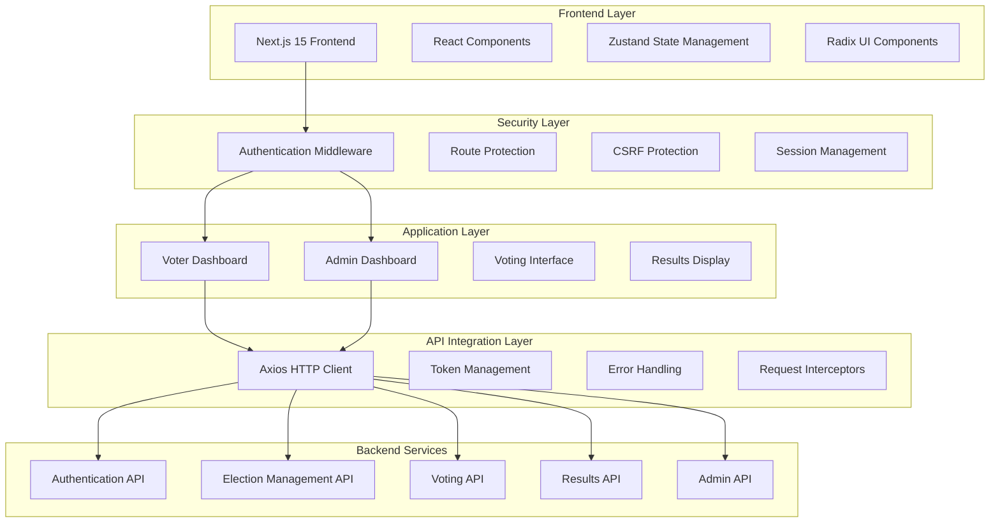
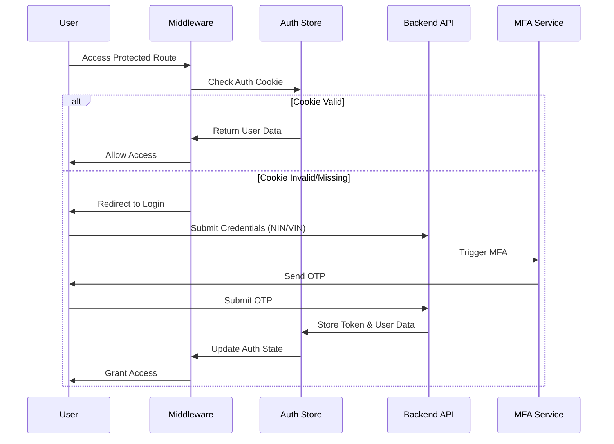

# Secure Ballot - Nigeria's Digital Voting Platform

<div align="center">
  
  
  <h3>Nigeria's Most Secure and Transparent Voting Platform</h3>
  <p>Empowering democracy through secure, transparent, and accessible digital voting for the 2027 Nigerian General Elections.</p>

  [](https://nextjs.org/)
  [](https://www.typescriptlang.org/)
  [](https://tailwindcss.com/)
  [](LICENSE)
</div>

## 📖 **Project Overview**

**Secure Ballot** is a comprehensive, enterprise-grade digital voting platform specifically engineered for Nigeria's electoral ecosystem. Built for the 2027 Nigerian General Elections, this platform addresses the unique challenges of conducting secure, transparent, and accessible elections across Nigeria's diverse geographic and linguistic landscape.

The platform supports the full spectrum of Nigerian elections including Presidential, Gubernatorial, House of Representatives, and Senatorial elections, with built-in support for Nigeria's federal structure including states, local government areas (LGAs), wards, and polling units.

### **Key Objectives**
- **Democratic Empowerment**: Enable secure digital voting for all eligible Nigerian voters
- **Transparency**: Provide real-time, verifiable election results and analytics
- **Accessibility**: Support multiple Nigerian languages and mobile-first design
- **Security**: Implement enterprise-grade security measures to prevent electoral fraud
- **Scalability**: Handle millions of concurrent voters across Nigeria's 36 states and FCT

## 🏛️ **System Architecture & Design**

### **High-Level Architecture**



### **Technical Architecture Patterns**

#### **1. Component-Driven Architecture**
The application follows a **component-driven development** approach with:
- **Atomic Design Principles**: Base components → Composed components → Page layouts
- **Separation of Concerns**: UI components, business logic hooks, and state management
- **Reusability**: Shared components across voter and admin interfaces
- **Type Safety**: Full TypeScript implementation with strict type checking

#### **2. State Management Architecture**
**Zustand** provides lightweight, scalable state management with:
- **Persistent Stores**: Authentication, election data, and user preferences
- **Cookie-based Persistence**: Secure session storage with proper flags
- **Reactive Updates**: Automatic UI updates on state changes
- **Store Segregation**: Separate stores for different concerns (auth, elections, UI)

#### **3. Security-First Design**
- **Defense in Depth**: Multiple security layers from middleware to API
- **Zero Trust Architecture**: Every request verified and authenticated
- **Principle of Least Privilege**: Role-based access control (RBAC)
- **Secure by Default**: Security controls built into every component

## 🔐 **Authentication & Authorization System**

### **Authentication Flow Architecture**



### **Multi-Factor Authentication (MFA)**
The platform implements comprehensive MFA supporting:

#### **Primary Authentication Methods**
- **NIN-based Login**: National Identification Number verification
- **VIN Integration**: Voter Identification Number cross-reference
- **USSD Authentication**: Mobile network-based authentication for areas with limited internet

#### **Secondary Authentication Factors**
- **SMS OTP**: One-time passwords via SMS
- **Time-based OTP (TOTP)**: Authenticator app support
- **Backup Codes**: Recovery codes for account access
- **Biometric Integration**: Future support for fingerprint/facial recognition

### **Authorization & Role-Based Access Control (RBAC)**

#### **User Roles & Permissions**

```typescript
// Role-based permission matrix
interface UserRoles {
  voter: {
    permissions: [
      'vote:cast',
      'results:view',
      'profile:manage',
      'elections:view'
    ]
  }
  admin: {
    systemAdministrator: [
      'system:manage',
      'users:manage',
      'elections:create',
      'results:manage'
    ],
    electoralCommissioner: [
      'elections:oversee',
      'results:verify',
      'reports:generate'
    ],
    securityOfficer: [
      'security:monitor',
      'audit:view',
      'incidents:manage'
    ]
  }
}
```

### **Session Management**
- **Secure Cookies**: HttpOnly, Secure, SameSite=Strict flags
- **Token Rotation**: Automatic refresh with sliding expiration
- **Session Timeout**: 30-minute idle timeout with renewal
- **Concurrent Session Control**: Limit active sessions per user

## 🛡️ **Middleware Security Layer**

The `middleware.ts` file implements a comprehensive security layer:

### **Route Protection Strategy**

```typescript
// Route classification system
const routeClassification = {
  public: [
    '/', '/login', '/register', '/about', '/faq'
  ],
  protected: [
    '/dashboard', '/vote', '/results', '/profile'
  ],
  admin: [
    '/admin/dashboard', '/admin/settings', '/admin/users'
  ],
  api: [
    '/api/auth', '/api/admin', '/api/elections'
  ]
}
```

### **Middleware Security Checks**
1. **Authentication Verification**: Token validity and user session
2. **Role-based Authorization**: Admin vs. voter access control
3. **MFA Enforcement**: Multi-factor authentication requirements
4. **Session Security**: Cookie tampering protection
5. **Rate Limiting**: Request throttling and abuse prevention
6. **CSRF Protection**: Cross-site request forgery prevention

### **Security Headers Implementation**
```typescript
// Security headers applied by middleware
const securityHeaders = {
  'X-Frame-Options': 'DENY',
  'X-Content-Type-Options': 'nosniff',
  'Referrer-Policy': 'strict-origin-when-cross-origin',
  'Strict-Transport-Security': 'max-age=31536000',
  'Content-Security-Policy': "default-src 'self'"
}
```

## 🗳️ **Voter Dashboard Architecture**

### **Dashboard Component Structure**

The voter dashboard (`src/app/dashboard/page.tsx`) provides a comprehensive voting interface:

#### **Core Dashboard Features**
1. **Election Overview Panel**
   - Active elections display
   - Voting status indicators
   - Deadline countdowns
   - Election type filtering

2. **Real-time Statistics**
   - Live vote counts
   - Turnout percentages
   - Regional breakdowns
   - Polling unit reporting status

3. **Interactive Electoral Map**
   - Geographic visualization of results
   - State-by-state breakdowns
   - LGA-level detail views
   - Real-time result updates

#### **Dashboard State Management**

```typescript
// Dashboard-specific state structure
interface DashboardState {
  electionData: {
    currentElection: Election | null;
    availableElections: Election[];
    votingStatus: VotingStatus;
    eligibility: EligibilityStatus;
  };
  statistics: {
    totalVotes: number;
    turnoutPercentage: number;
    pollingUnitsReported: number;
    registeredVoters: number;
  };
  filters: {
    electionType: string;
    region: string;
    timeRange: string;
  };
}
```

#### **Responsive Design Implementation**
- **Mobile-First Approach**: Optimized for smartphones and tablets
- **Progressive Enhancement**: Advanced features for desktop users
- **Touch-Friendly Interface**: Large touch targets and gesture support
- **Offline Capabilities**: Basic functionality without internet connection

## 👨‍💼 **Admin Dashboard Architecture**

### **Administrative Interface Design**

The admin dashboard (`src/app/admin/dashboard/page.tsx`) provides comprehensive election management:

#### **Admin Dashboard Modules**

1. **System Overview Panel**
   ```typescript
   // System metrics monitoring
   interface SystemMetrics {
     serverHealth: ServerStatus;
     databasePerformance: DbMetrics;
     apiResponseTimes: ResponseMetrics;
     activeUsers: UserActivityMetrics;
     securityAlerts: SecurityAlert[];
   }
   ```

2. **Election Management Interface**
   - Election creation and configuration
   - Candidate management and verification
   - Polling unit assignment and monitoring
   - Election timeline management

3. **Voter Management System**
   - Voter registration oversight
   - Profile verification processes
   - Bulk data import/export
   - Duplicate detection and resolution

4. **Security & Monitoring Panel**
   - Real-time security threat detection
   - Audit log analysis and reporting
   - Suspicious activity flagging
   - System performance monitoring

#### **Admin Role Hierarchy**

```typescript
// Administrative role structure
enum AdminRoles {
  SYSTEM_ADMINISTRATOR = 'SystemAdministrator',
  ELECTORAL_COMMISSIONER = 'ElectoralCommissioner', 
  SECURITY_OFFICER = 'SecurityOfficer',
  SYSTEM_AUDITOR = 'SystemAuditor',
  REGIONAL_ELECTORAL_OFFICER = 'RegionalElectoralOfficer',
  ELECTION_MANAGER = 'ElectionManager',
  RESULT_VERIFICATION_OFFICER = 'ResultVerificationOfficer'
}
```

### **Admin Security Controls**
- **Elevated Authentication**: Additional security layers for admin access
- **Action Logging**: Comprehensive audit trails for all admin actions
- **IP Whitelisting**: Restrict admin access to approved locations
- **Time-based Access**: Schedule-based admin access controls

## 🎯 **Voting Interface System**

### **Voting Process Architecture**

The voting interface (`src/app/vote/page.tsx`) implements a secure, user-friendly voting experience:

#### **Multi-Step Voting Process**

1. **Election Selection Phase**
   ```typescript
   // Election type selection with eligibility verification
   interface ElectionSelection {
     electionType: 'presidential' | 'gubernatorial' | 'senate' | 'house';
     eligibilityStatus: EligibilityCheck;
     voterQualifications: VoterQualification[];
     pollingUnitAssignment: PollingUnit;
   }
   ```

2. **Candidate Review Phase**
   - Candidate profile viewing
   - Party manifesto access
   - Candidate comparison tools
   - Accessibility options (audio descriptions, large text)

3. **Vote Casting Phase**
   ```typescript
   // Secure vote casting with verification
   interface VoteCasting {
     selectedCandidate: Candidate;
     encryptedVote: EncryptedVoteData;
     receiptGeneration: VoteReceipt;
     blockchainHash?: string; // Future enhancement
   }
   ```

4. **Verification Phase**
   - Vote receipt generation
   - Verification code provision
   - Confirmation display
   - Audit trail creation

#### **Vote Security Measures**
- **End-to-End Encryption**: Vote data encrypted from client to database
- **Receipt Generation**: Tamper-proof vote receipts with verification codes
- **Duplicate Vote Prevention**: Technical and business logic controls
- **Audit Trail**: Comprehensive logging without voter identity exposure

## 🌍 **Internationalization (i18n) System**

### **Multi-Language Support Architecture**

The platform supports Nigeria's linguistic diversity with comprehensive i18n:

#### **Supported Languages**
- **English (en)**: Primary language, complete coverage
- **Hausa (ha)**: Northern Nigeria, 439 translation keys  
- **Yoruba (yo)**: Southwest Nigeria, 237 translation keys
- **Igbo (ig)**: Southeast Nigeria, 238 translation keys
- **Nigerian Pidgin (pcm)**: Universal informal language, 238 translation keys

#### **Translation Management System**

```typescript
// Translation structure and management
interface TranslationStructure {
  auth: AuthTranslations;
  dashboard: DashboardTranslations;
  voting: VotingTranslations;
  results: ResultsTranslations;
  admin: AdminTranslations;
  common: CommonTranslations;
  legal: LegalTranslations; // Terms, privacy, etc.
}

// Dynamic language switching
const LanguageProvider = {
  context: LanguageContext,
  state: {
    currentLanguage: Language,
    availableLanguages: Language[],
    translations: TranslationDictionary,
    isLoading: boolean
  },
  methods: {
    changeLanguage: (lang: Language) => void,
    translate: (key: string, params?: object) => string,
    formatDate: (date: Date, format?: string) => string,
    formatNumber: (num: number, options?: NumberFormatOptions) => string
  }
}
```

#### **Cultural Localization Features**
- **Date/Time Formatting**: Nigerian date conventions and time zones
- **Currency Display**: Naira (₦) formatting and display
- **Number Formatting**: Nigerian number conventions
- **RTL Support**: Future Arabic script support preparation
- **Cultural Imagery**: Region-appropriate visual elements

## 📊 **State Management Architecture**

### **Zustand Store Design**

The application uses **Zustand** for lightweight, performant state management:

#### **Store Segregation Strategy**

```typescript
// Separated stores for different concerns
interface StoreArchitecture {
  authStore: AuthenticationState;      // User auth, sessions, MFA
  electionStore: ElectionState;        // Elections, candidates, results  
  votingStore: VotingState;           // Voting status, receipts, history
  uiStore: UIState;                   // Loading states, notifications, themes
  voterStore: VoterState;             // Voter profiles, polling units
  adminStore: AdminState;             // Admin data, system metrics
}
```

#### **Persistent State Management**

```typescript
// Cookie-based persistence with security
const cookieStorage = {
  security: {
    expires: 30/1440, // 30 minutes
    secure: process.env.NODE_ENV === 'production',
    sameSite: 'strict',
    httpOnly: false // Client-side access needed
  },
  errorHandling: {
    parseValidation: true,
    corruptionRecovery: true,
    automaticCleanup: true
  }
}
```

#### **State Synchronization**
- **Real-time Updates**: WebSocket integration for live data
- **Optimistic Updates**: Immediate UI feedback with rollback capability  
- **Cache Invalidation**: Smart cache management for data consistency
- **Offline Support**: State persistence during network interruptions

## 🔗 **API Integration Layer**

### **Centralized API Client Architecture**

The `src/services/api.ts` implements a robust API integration layer:

#### **HTTP Client Configuration**

```typescript
// Axios instance with comprehensive configuration
const apiClient = {
  baseURL: process.env.NEXT_PUBLIC_API_URL,
  timeout: 30000,
  headers: {
    'Content-Type': 'application/json',
    'X-Client-Version': packageJSON.version,
    'X-Platform': 'web'
  },
  interceptors: {
    request: tokenInjection,
    response: errorHandling,
    retry: exponentialBackoff
  }
}
```

#### **Token Management System**

```typescript
// Automatic token refresh and rotation
const tokenManager = {
  refreshStrategy: 'sliding-expiration',
  refreshThreshold: 5 * 60 * 1000, // 5 minutes before expiry
  retryAttempts: 3,
  backoffStrategy: 'exponential',
  
  refreshFlow: async (expiredToken: string) => {
    // Use separate API instance to avoid circular dependency
    const newToken = await refreshApi.post('/auth/refresh-token');
    authStore.updateToken(newToken);
    return newToken;
  }
}
```

#### **API Endpoint Organization**

```typescript
// Modular API organization by feature
export const apiModules = {
  auth: AuthenticationAPI,      // Login, register, MFA, logout
  voter: VoterAPI,             // Profile, polling unit, verification
  election: ElectionAPI,        // Elections, candidates, details
  voting: VotingAPI,           // Cast vote, verify, receipts
  results: ResultsAPI,         // Live results, statistics, analytics
  admin: AdminAPI,             // Management, monitoring, reports
  ussd: USSDAPI               // USSD authentication and voting
}
```

### **Error Handling & Resilience**

#### **Comprehensive Error Management**

```typescript
// Error handling strategy
interface ErrorHandling {
  networkErrors: {
    retry: true,
    maxAttempts: 3,
    backoffStrategy: 'exponential'
  },
  authenticationErrors: {
    autoLogout: true,
    redirectToLogin: true,
    clearSession: true
  },
  validationErrors: {
    displayToUser: true,
    logForDebugging: true,
    fallbackActions: true
  },
  serverErrors: {
    gracefulDegradation: true,
    offlineMode: true,
    userNotification: true
  }
}
```

## 🎨 **Component Architecture & UI Design**

### **Design System Implementation**

#### **Component Hierarchy**

```typescript
// Component architecture layers
interface ComponentArchitecture {
  foundations: {
    tokens: DesignTokens,      // Colors, typography, spacing
    primitives: RadixUI,       // Accessible base components  
    utilities: TailwindCSS     // Utility-first styling
  },
  
  components: {
    atoms: BaseComponents,      // Button, Input, Label
    molecules: ComposedComponents, // FormField, SearchBox
    organisms: FeatureComponents,  // ElectionCard, VotingPanel
    templates: PageLayouts,     // DashboardLayout, AdminLayout
    pages: CompletePages       // Dashboard, Vote, Results
  }
}
```

#### **Accessibility (a11y) Implementation**

```typescript
// WCAG 2.1 AA compliance features
interface AccessibilityFeatures {
  keyboardNavigation: {
    tabOrder: 'logical',
    skipLinks: true,
    focusManagement: 'comprehensive'
  },
  
  screenReaderSupport: {
    ariaLabels: 'complete',
    liveRegions: 'implemented',
    semanticMarkup: 'proper'
  },
  
  visualAccessibility: {
    colorContrast: 'AAA-compliant',
    textScaling: 'up-to-200%',
    motionReduction: 'respected'
  },
  
  cognitiveAccessibility: {
    clearInstructions: true,
    errorPrevention: true,
    timeoutWarnings: true
  }
}
```

### **Theme System**

```typescript
// Dynamic theme management
interface ThemeSystem {
  modes: ['light', 'dark', 'system'],
  colors: {
    primary: 'hsl(var(--primary))',
    secondary: 'hsl(var(--secondary))',
    accent: 'hsl(var(--accent))',
    // ... Nigerian-inspired color palette
  },
  
  responsive: {
    mobile: '320px-767px',
    tablet: '768px-1023px', 
    desktop: '1024px+',
    breakpoints: 'mobile-first'
  },
  
  animations: {
    reducedMotion: 'respected',
    performance: 'optimized',
    accessibility: 'compliant'
  }
}
```

## 🔧 **Custom Hooks Architecture**

The application includes **35+ custom React hooks** for reusable business logic:

### **Hook Categories**

#### **Authentication Hooks**
```typescript
// Authentication and session management
useAuth()          // Core authentication logic
useAuthStore()     // Auth state management  
useMFA()          // Multi-factor authentication
useUSSD()         // USSD authentication flow
```

#### **Election & Voting Hooks**
```typescript
// Election and voting functionality
useElectionData()  // Election data fetching and management
useVote()         // Voting process logic
useResults()      // Results fetching and real-time updates
useElections()    // Election list management
useVoterProfile() // Voter profile and polling unit data
```

#### **UI & Utility Hooks**
```typescript
// UI interaction and utility functions
useMediaQuery()   // Responsive design helpers
useLocalStorage() // Browser storage management
useDebounce()     // Input debouncing
useTouch()        // Touch gesture handling
useMobile()       // Mobile-specific functionality
useThrottle()     // Performance optimization
```

#### **Admin & Dashboard Hooks**
```typescript
// Administrative functionality
useAdminData()    // Admin dashboard data
useDashboard()    // Dashboard state management
usePollingUnit()  // Polling unit management
useVoterData()    // Voter data management
```

### **Hook Design Patterns**

```typescript
// Standard hook structure with error handling
const useCustomHook = () => {
  const [state, setState] = useState(initialState);
  const [loading, setLoading] = useState(false);
  const [error, setError] = useState<Error | null>(null);
  
  const performAction = useCallback(async (params) => {
    try {
      setLoading(true);
      setError(null);
      const result = await apiCall(params);
      setState(result);
      return { success: true, data: result };
    } catch (err) {
      setError(err);
      return { success: false, error: err };
    } finally {
      setLoading(false);
    }
  }, []);
  
  return {
    state,
    loading,
    error,
    performAction,
    // ... other hook methods
  };
};
```

## 📱 **Progressive Web App (PWA) Features**

### **Mobile-First Design Philosophy**

The platform is built with a **mobile-first approach** considering Nigeria's mobile-dominant internet usage:

#### **Responsive Breakpoints**
```css
/* Mobile-first responsive design */
.responsive-grid {
  /* Mobile: 320px - 767px */
  grid-template-columns: 1fr;
  
  /* Tablet: 768px - 1023px */
  @media (min-width: 768px) {
    grid-template-columns: repeat(2, 1fr);
  }
  
  /* Desktop: 1024px+ */
  @media (min-width: 1024px) {
    grid-template-columns: repeat(3, 1fr);
  }
}
```

#### **Performance Optimizations**
- **Code Splitting**: Lazy loading for admin components
- **Image Optimization**: Next.js Image component with WebP support
- **Bundle Analysis**: Webpack bundle analyzer integration
- **Caching Strategy**: Strategic service worker implementation

### **Offline Capabilities**
```typescript
// Offline functionality for areas with poor connectivity
interface OfflineSupport {
  voteCaching: {
    storeVotesLocally: true,
    syncWhenOnline: true,
    encryptionAtRest: true
  },
  
  resultsCaching: {
    lastKnownResults: true,
    updateIndicators: true,
    syncNotifications: true
  },
  
  profileData: {
    localProfile: true,
    offlineVerification: true,
    cacheDuration: '24h'
  }
}
```

## 🔒 **Security Implementation Details**

### **Comprehensive Security Strategy**

#### **Data Protection**
```typescript
// Multi-layer encryption implementation
interface SecurityLayers {
  transportLayer: {
    protocol: 'HTTPS/TLS 1.3',
    certificateType: 'EV SSL',
    hstsEnabled: true,
    hpkpImplemented: true
  },
  
  applicationLayer: {
    encryption: 'AES-256-GCM',
    keyRotation: 'daily',
    saltGeneration: 'cryptographically-secure',
    hashAlgorithm: 'bcrypt-rounds-12'
  },
  
  sessionLayer: {
    tokenType: 'JWT-signed',
    tokenExpiry: '30-minutes',
    refreshTokens: true,
    sessionFixation: 'prevented'
  }
}
```

#### **Input Validation & Sanitization**
```typescript
// Comprehensive input validation using Zod
const voterValidationSchema = z.object({
  nin: z.string()
    .length(11, 'NIN must be exactly 11 digits')
    .regex(/^\d{11}$/, 'NIN must contain only numbers'),
    
  vin: z.string()
    .length(19, 'VIN must be exactly 19 characters')
    .regex(/^[0-9A-Z]{2}[0-9]{6}[A-Z]{2}[0-9]{9}$/, 'Invalid VIN format'),
    
  phoneNumber: z.string()
    .regex(/^(\+234|0)[789][01]\d{8}$/, 'Invalid Nigerian phone number'),
    
  password: z.string()
    .min(8, 'Password must be at least 8 characters')
    .regex(/^(?=.*[a-z])(?=.*[A-Z])(?=.*\d)(?=.*[@$!%*?&])[A-Za-z\d@$!%*?&]/, 
           'Password must contain uppercase, lowercase, number, and special character')
});
```

### **Audit & Compliance**
```typescript
// Comprehensive audit logging
interface AuditSystem {
  userActions: {
    login: true,
    logout: true,
    votecast: true,
    profileUpdate: true,
    adminActions: true
  },
  
  systemEvents: {
    securityAlerts: true,
    performanceMetrics: true,
    errorOccurrences: true,
    apiCalls: true
  },
  
  complianceReporting: {
    electoralCommissionReports: true,
    securityIncidentReports: true,
    performanceReports: true,
    accessLogs: true
  }
}
```

## 📊 **Analytics & Monitoring**

### **Real-time Monitoring Dashboard**

#### **System Performance Metrics**
```typescript
// Comprehensive monitoring implementation
interface MonitoringMetrics {
  performanceMetrics: {
    responseTime: 'avg-p95-p99',
    throughput: 'requests-per-second',
    errorRate: 'percentage',
    uptime: '99.9%-target'
  },
  
  businessMetrics: {
    activeVoters: 'real-time-count',
    votesCast: 'running-total',
    electionParticipation: 'percentage',
    regionalDistribution: 'geographic-breakdown'
  },
  
  securityMetrics: {
    failedLogins: 'rate-monitoring',
    suspiciousActivity: 'ml-detection',
    securityAlerts: 'real-time-alerts',
    accessPatterns: 'anomaly-detection'
  }
}
```

#### **Electoral Analytics**
- **Real-time Vote Counting**: Live updates with sub-second latency
- **Turnout Analytics**: Voter participation tracking by demographics
- **Geographic Visualization**: Interactive maps with drill-down capabilities
- **Trend Analysis**: Historical comparison and predictive modeling

## 🚀 **Performance Optimization**

### **Frontend Performance Strategy**

#### **Bundle Optimization**
```typescript
// Webpack optimization configuration
const performanceOptimizations = {
  codesplitting: {
    strategy: 'route-based',
    adminComponents: 'lazy-loaded',
    vendorChunks: 'separated',
    dynamicImports: 'implemented'
  },
  
  assetOptimization: {
    images: 'next-image-webp',
    fonts: 'preloaded',
    css: 'critical-inlined',
    javascript: 'tree-shaken'
  },
  
  caching: {
    staticAssets: '1-year',
    apiResponses: 'conditional',
    browserCaching: 'optimized',
    cdnCaching: 'configured'
  }
}
```

#### **Runtime Performance**
- **React Optimization**: Memo, useMemo, useCallback for expensive operations
- **State Management**: Minimal re-renders with Zustand
- **API Optimization**: Request deduplication and caching
- **Memory Management**: Proper cleanup and garbage collection

## 🌟 Features

### 🗳️ **Comprehensive Voting System**
- **Multi-Election Support**: Presidential, Gubernatorial, House of Representatives, and Senatorial elections
- **Secure Authentication**: NIN/VIN-based login with multi-factor authentication
- **Real-time Results**: Live election monitoring and result visualization
- **Vote Verification**: Tamper-proof vote receipts and verification system

### 🌍 **Accessibility & Internationalization**
- **Multi-language Support**: English, Hausa, Yoruba, Igbo, and Nigerian Pidgin
- **Responsive Design**: Optimized for desktop, tablet, and mobile devices
- **Dark/Light Theme**: User preference-based theme switching
- **Accessibility**: WCAG compliant with proper ARIA labels

### 🔒 **Enterprise-Grade Security**
- **End-to-End Encryption**: AES-256 encryption for all sensitive data
- **Route Protection**: Middleware-based authentication and authorization
- **Secure Storage**: Cookie-based session management with security flags
- **Audit Trails**: Comprehensive logging and monitoring

### 📊 **Advanced Analytics**
- **Real-time Dashboards**: Live election statistics and monitoring
- **Interactive Charts**: Pie charts, bar charts, and trend analysis
- **Electoral Maps**: Geographic visualization of election results
- **Regional Analytics**: Geopolitical zone and state-level breakdowns

### 👨‍💼 **Administrative Controls**
- **Admin Dashboard**: Comprehensive election management interface
- **User Management**: Voter registration and profile management
- **System Monitoring**: Real-time system health and security alerts
- **Result Management**: Election result compilation and publication

## 🏗️ Technology Stack

### **Frontend Framework**
- **Next.js 15** - React framework with App Router
- **TypeScript** - Type-safe JavaScript development
- **React 19** - Latest React features and optimizations

### **Styling & UI**
- **Tailwind CSS** - Utility-first CSS framework
- **Radix UI** - Accessible component primitives
- **Framer Motion** - Animation and gesture library
- **Lucide React** - Beautiful icon library

### **State Management & Data**
- **Zustand** - Lightweight state management
- **Axios** - HTTP client for API communication
- **React Hook Form** - Performant form handling
- **Zod** - TypeScript-first schema validation

### **Development Tools**
- **ESLint** - Code linting and formatting
- **PostCSS** - CSS processing and optimization
- **Autoprefixer** - CSS vendor prefixing

## 📁 Project Structure

```
src/
├── app/                    # Next.js App Router pages
│   ├── admin/             # Admin dashboard and management
│   │   ├── dashboard/     # Admin overview and controls
│   │   ├── login/         # Admin authentication
│   │   ├── profile/       # Admin profile management
│   │   └── settings/      # System configuration
│   ├── dashboard/         # User dashboard
│   │   ├── profile/       # User profile management
│   │   └── settings/      # User preferences
│   ├── vote/              # Voting interface
│   ├── results/           # Election results display
│   ├── election-dashboard/ # Real-time election monitoring
│   ├── live-stats/        # Live statistics page
│   ├── login/             # User authentication
│   ├── about/             # About page
│   ├── contact/           # Contact information
│   ├── faq/               # Frequently asked questions
│   ├── privacy/           # Privacy policy
│   ├── terms/             # Terms of service
│   └── security/          # Security information
├── components/            # Reusable UI components
│   ├── ui/               # Base UI components (Radix-based)
│   ├── admin/            # Admin-specific components
│   ├── providers/        # Context providers
│   └── [feature-components] # Feature-specific components
├── hooks/                # Custom React hooks (35+ hooks)
│   ├── useAuth.ts        # Authentication logic
│   ├── useElectionData.ts # Election data management
│   ├── useVote.ts        # Voting functionality
│   ├── useResults.ts     # Results fetching
│   └── [utility-hooks]   # Various utility hooks
├── lib/                  # Utilities and configurations
│   ├── i18n/            # Internationalization
│   │   ├── LanguageContext.tsx
│   │   └── translations/ # Language files
│   └── utils/           # Utility functions
├── services/             # API integration
│   └── api.ts           # Centralized API client
├── store/                # Zustand state management
│   └── useStore.ts      # Global state stores
└── styles/               # Global styles
    └── globals.css      # Global CSS styles
```

## 🚀 Getting Started

### Prerequisites

- **Node.js** 18.0 or later
- **npm** or **pnpm** package manager
- **Git** for version control

### Installation

1. **Clone the repository**
   ```bash
   git clone https://github.com/Onyex101/secure_ballot_frontend.git
   cd secure_ballot_frontend
   ```

2. **Install dependencies**
   ```bash
   npm install
   # or
   pnpm install
   ```

3. **Environment Setup**
   ```bash
   cp .env.example .env.local
   ```
   
   Configure your environment variables:
   ```env
   NEXT_PUBLIC_API_URL=http://localhost:5000/api/v1
   NEXT_PUBLIC_APP_URL=http://localhost:3000
   NODE_ENV=development
   ```

4. **Run the development server**
   ```bash
   npm run dev
   # or
   pnpm dev
   ```

5. **Open your browser**
   Navigate to [http://localhost:3000](http://localhost:3000)

### Build for Production

```bash
# Build the application
npm run build

# Start production server
npm run start
```

## 🔧 Configuration

### Environment Variables

| Variable | Description | Default |
|----------|-------------|---------|
| `NEXT_PUBLIC_API_URL` | Backend API endpoint | `http://localhost:5000/api/v1` |
| `NEXT_PUBLIC_APP_URL` | Frontend application URL | `http://localhost:3000` |
| `NODE_ENV` | Environment mode | `development` |

### Internationalization

The application supports 5 languages:
- **English** (en) - Default
- **Hausa** (ha)
- **Yoruba** (yo)
- **Igbo** (ig)
- **Nigerian Pidgin** (pcm)

Language files are located in `src/lib/i18n/translations/`

## 🎯 Usage

### For Voters

1. **Registration/Login**
   - Enter your NIN (National Identification Number)
   - Provide your VIN (Voter Identification Number)
   - Complete multi-factor authentication

2. **Voting Process**
   - Select election type (Presidential, Gubernatorial, etc.)
   - Review candidates and their manifestos
   - Cast your vote securely
   - Receive vote confirmation receipt

3. **Result Monitoring**
   - View real-time election results
   - Track voting statistics
   - Access detailed analytics

### For Administrators

1. **Admin Access**
   - Login with admin credentials
   - Access comprehensive dashboard

2. **Election Management**
   - Monitor voting progress
   - Manage candidates and elections
   - View system analytics
   - Handle security alerts

## 🔒 Security Features

- **Multi-Factor Authentication**: NIN/VIN + OTP verification
- **End-to-End Encryption**: All sensitive data encrypted
- **Route Protection**: Middleware-based access control
- **Session Management**: Secure cookie-based sessions
- **Audit Logging**: Comprehensive activity tracking
- **CSRF Protection**: Cross-site request forgery prevention

## 📊 API Integration

The frontend integrates with a RESTful backend API:

### Authentication Endpoints
- `POST /auth/login` - User authentication
- `POST /auth/register` - User registration
- `POST /auth/verify-mfa` - Multi-factor authentication

### Election Endpoints
- `GET /elections` - Fetch elections
- `GET /elections/:id` - Get election details
- `POST /elections/:id/vote` - Cast vote

### Results Endpoints
- `GET /results/live/:id` - Live results
- `GET /results/statistics/:id` - Election statistics

## 🧪 Testing

```bash
# Run unit tests
npm run test

# Run integration tests
npm run test:integration

# Run end-to-end tests
npm run test:e2e

# Generate coverage report
npm run test:coverage
```

## 🚀 Deployment

### Vercel (Recommended)

1. **Connect your repository** to Vercel
2. **Configure environment variables** in Vercel dashboard
3. **Deploy** automatically on push to main branch

### Docker

```bash
# Build Docker image
docker build -t secure-ballot-frontend .

# Run container
docker run -p 3000:3000 secure-ballot-frontend
```

### Manual Deployment

```bash
# Build for production
npm run build

# Export static files (if needed)
npm run export

# Deploy build folder to your hosting provider
```

## 🤝 Contributing

We welcome contributions! Please see our [Contributing Guidelines](CONTRIBUTING.md) for details.

### Development Workflow

1. **Fork** the repository
2. **Create** a feature branch (`git checkout -b feature/amazing-feature`)
3. **Commit** your changes (`git commit -m 'Add amazing feature'`)
4. **Push** to the branch (`git push origin feature/amazing-feature`)
5. **Open** a Pull Request

### Code Standards

- Follow TypeScript best practices
- Use ESLint and Prettier for code formatting
- Write meaningful commit messages
- Add tests for new features
- Update documentation as needed

## 📝 License

This project is licensed under the MIT License - see the [LICENSE](LICENSE) file for details.

## 🆘 Support

### Documentation
- [API Documentation](docs/api.md)
- [Component Library](docs/components.md)
- [Deployment Guide](docs/deployment.md)

### Community
- [GitHub Issues](https://github.com/your-username/secure-ballot-frontend/issues)
- [Discussions](https://github.com/your-username/secure-ballot-frontend/discussions)
- [Discord Community](https://discord.gg/secure-ballot)

### Contact
- **Email**: support@secureballot.ng
- **Website**: [https://secureballot.ng](https://secureballot.ng)
- **Twitter**: [@SecureBallotNG](https://twitter.com/SecureBallotNG)

## 🙏 Acknowledgments

- **INEC** - Independent National Electoral Commission of Nigeria
- **Open Source Community** - For the amazing tools and libraries
- **Contributors** - Everyone who has contributed to this project
- **Beta Testers** - For their valuable feedback and testing

## 📈 Roadmap

### Version 2.0 (Q2 2024)
- [ ] Blockchain integration for vote immutability
- [ ] Advanced biometric authentication
- [ ] Mobile application (React Native)
- [ ] Offline voting capability

### Version 2.1 (Q3 2024)
- [ ] AI-powered fraud detection
- [ ] Enhanced accessibility features
- [ ] Real-time notifications
- [ ] Advanced analytics dashboard

### Version 3.0 (Q4 2024)
- [ ] Multi-country support
- [ ] Advanced reporting tools
- [ ] Integration with national databases
- [ ] Enhanced security protocols

---

<div align="center">
  <p><strong>Secure Ballot</strong> - Empowering Democracy Through Technology</p>
  <p>Made with ❤️ for Nigeria's Democratic Future</p>
</div> 